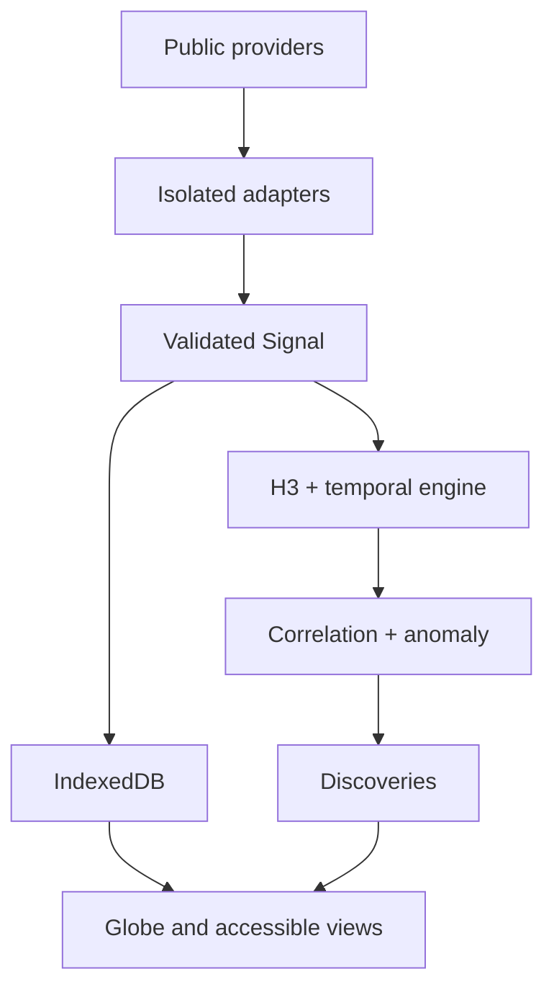

# NEXUS

> **See the world connect.**

NEXUS is a mobile-first, privacy-friendly global signal discovery system. It transforms legitimate public data into a traceable model of what is happening on Earth—without paid APIs, accounts, trackers, a proprietary backend, or runtime AI.

The current release is a working foundation and first real-world vertical slice. It includes a cinematic interactive globe, deterministic demonstration network, live USGS earthquake ingestion, normalized Signals, H3 indexing, local persistence, temporal filtering, conservative correlation, anomaly scoring, Discoveries, saved Cases, Observer Mode, offline PWA support, provider health, and source provenance.

## Quick start

```bash
npm install
npm run dev
```

Production verification:

```bash
npm run typecheck
npm run lint
npm test
npm run build
```

## Architecture



- **UI:** React, TypeScript, Vite, React Globe GL, Three.js
- **State:** Zustand
- **Persistence:** Dexie/IndexedDB with bounded retention
- **Validation:** Zod at provider boundaries
- **Spatial engine:** H3 plus deterministic distance calculations
- **Offline:** Vite PWA/Workbox application shell and USGS runtime cache
- **Data boundary:** visualizations never consume provider-native payloads

## Supported sources

| Source | State | Notes |
|---|---|---|
| USGS Earthquakes | Live | Official real-time GeoJSON; complete first vertical slice |
| NEXUS Demo Network | Built in | Deterministic earthquake, fire, weather, aircraft, satellite, media, and space-weather examples |
| NWS, SWPC, Open-Meteo | Planned adapters | Interfaces and provenance model are ready |
| NASA FIRMS, GDELT, SatNOGS, OpenSky | Planned adapters | Optional credentials and rate limits will remain isolated |

## Privacy and credibility

- No accounts, analytics, ads, telemetry, or cloud profile.
- Saved Cases and settings stay in local IndexedDB.
- Location is requested only from Observer Mode, with an explanation first.
- Every Signal carries provider, freshness, timestamp, and provenance.
- Correlations state measurable proximity and never claim causation.
- Demonstration data is always marked `DEMO DATA` and never presented as live.

## Deployment

NEXUS builds to static files in `dist/`. The relative Vite base supports GitHub Pages, Cloudflare Pages, Netlify, and Vercel. GitHub Pages can host the app, but a platform with configurable security headers and preview deployments is preferable for production iteration.

## Limitations

- Detailed MapLibre investigation mode and replay tracks are not yet shipped.
- Baselines are currently recent-device baselines; longer statistical history will improve anomaly context.
- USGS is the only live provider in the initial vertical slice.
- Globe texture is intentionally bundled and stylized so the core Earth experience remains offline-capable.

See [`docs/ROADMAP.md`](docs/ROADMAP.md) for sequenced expansion and [`docs/RESEARCH.md`](docs/RESEARCH.md) for open-source research and license notes.

## License

No project license has been selected yet. Dependencies retain their respective licenses. Choose a project license before public distribution.
