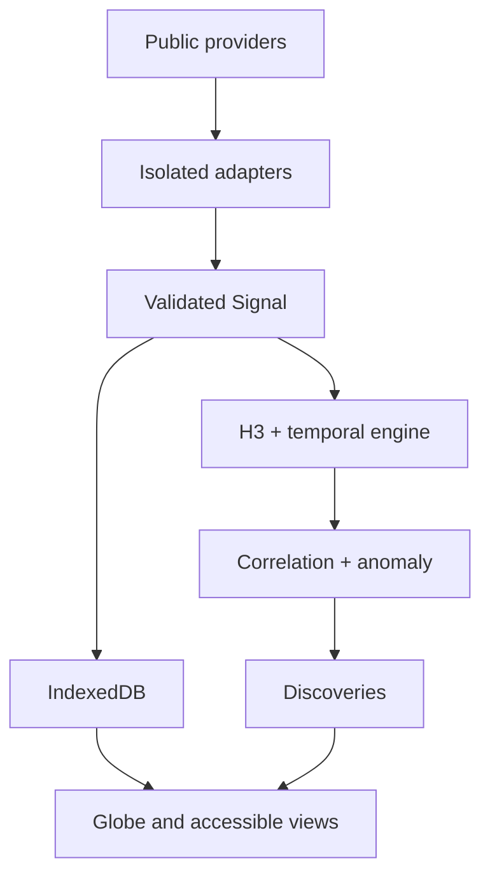

# NEXUS

> **See the world connect.**

NEXUS is a mobile-first, privacy-friendly global signal discovery system. It transforms legitimate public data into a traceable model of what is happening on Earth—without paid APIs, accounts, trackers, a proprietary backend, or runtime AI.

The current release is a working multi-source vertical slice. It includes a NASA-textured interactive globe with astronomical live illumination and explicit day/night overrides, a geographically accurate MapLibre investigation map, best-effort global RainViewer radar with official NOAA fallback, near-real-time NOAA GeoColor cloud imagery, live USGS earthquakes, NWS severe-weather alerts with preserved polygons, NASA EONET natural events, GDACS global impact alerts, NOAA space weather, optional NASA FIRMS thermal detections, Open‑Meteo Observer context, normalized Signals, H3 indexing, local persistence, temporal filtering and replay, contextual Lens presets, bounded conservative correlation, anomaly scoring, Discoveries, durable Cases with notes and evidence export, offline PWA support, provider health, source provenance, and a safe recovery screen.

## Quick start

```bash
npm install
npm run dev
```

Production verification:

```bash
npm run typecheck
npm run lint
npm test
npm run build
```

For a single self-contained HTML file suitable for temporary phone previews:

```bash
npm run build:phone-preview
```

The output is `dist-preview/nexus-phone-preview.html`. The installable PWA still requires normal HTTPS hosting so service workers and Home Screen installation work correctly.

## Architecture



- **UI:** React, TypeScript, Vite, React Globe GL, Three.js, MapLibre GL JS
- **State:** Zustand
- **Persistence:** Dexie/IndexedDB with bounded retention
- **Validation:** Zod at provider boundaries
- **Spatial engine:** H3 plus deterministic distance calculations
- **Offline:** Vite PWA/Workbox shell plus bounded provider and map-tile caches
- **Data boundary:** visualizations never consume provider-native payloads

## Supported sources

| Source | State | Notes |
|---|---|---|
| USGS Earthquakes | Live | Official global real-time GeoJSON |
| NWS Alerts | Live | Official U.S. watches, warnings, and advisories with polygons |
| NASA EONET | Live/delayed | Keyless global natural events from authoritative source aggregation |
| GDACS | Live/delayed | Keyless global cyclone, flood, volcano, drought, and wildfire impact alerts |
| NOAA SWPC | Live | Global NOAA R/S/G space-weather scales |
| NASA FIRMS | Optional live/delayed | User-supplied free MAP key stored only on-device |
| Open‑Meteo | On demand | Globally ranked place search plus weather, selectable units, air quality, and location-local sunrise/sunset in Observer Mode |
| RainViewer + NOAA/NWS MRMS | Live overlay | Latest global best-effort radar in Detail Map; official U.S. composite fallback and globe context |
| NOAA/NESDIS GeoColor | Live overlay | Latest merged GOES-East/West observed cloud imagery |
| NEXUS Demo Network | Built in | Deterministic, isolated replacement mode for exploration and testing |

## Privacy and credibility

- No accounts, analytics, ads, telemetry, or cloud profile.
- Saved Cases, settings, credentials, and saved Observer points stay on the device and can be erased from Storage.
- Location is requested only from Observer Mode, with an explanation first.
- Every Signal carries provider, freshness, timestamp, and provenance.
- Correlations state measurable proximity and never claim causation.
- Demonstration data is always marked `DEMO DATA` and never presented as live.

## Deployment

NEXUS builds to static files in `dist/`. The included `Deploy NEXUS` workflow publishes `main` through GitHub Pages when Pages is configured to use GitHub Actions. The relative Vite base also supports Cloudflare Pages, Netlify, and Vercel without platform coupling.

## Limitations

- Radar availability and coverage remain provider-dependent. RainViewer is a best-effort enhancement with no SLA; NOAA fallback coverage is regional, and neither source is presented as a forecast.
- The current satellite layer covers the operational GOES-East/West domain rather than the poles and is labeled as observed imagery.
- Baselines are currently recent-device baselines; longer statistical history will improve anomaly context.
- FIRMS requires the user to enter a free NASA MAP key locally; it is never committed or bundled.
- Moving-track reconstruction and high-frequency geostationary satellite animation remain sequenced work; global replay currently replays stored evidence timestamps.

See [`docs/ROADMAP.md`](docs/ROADMAP.md) for sequenced expansion and [`docs/RESEARCH.md`](docs/RESEARCH.md) for open-source research and license notes.

## License

No project license has been selected yet. Dependencies retain their respective licenses. Choose a project license before public distribution.
