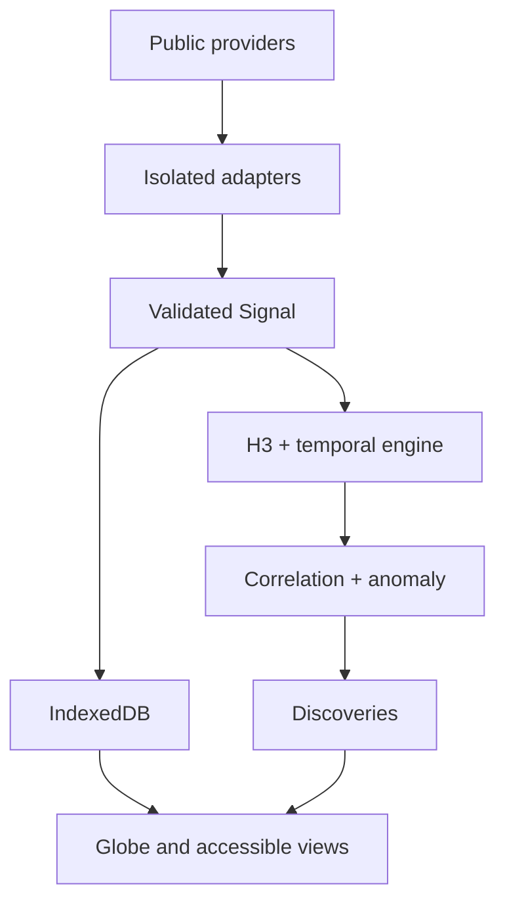

# NEXUS

> **See the world connect.**

NEXUS is a mobile-first, privacy-friendly global signal discovery system. It transforms legitimate public data into a traceable model of what is happening on Earth—without paid APIs, accounts, trackers, a proprietary backend, or runtime AI.

The current release is a working multi-source vertical slice. It includes a NASA-textured interactive globe with astronomical illumination, zoom-aware offline city labels and borders, a detailed MapLibre investigation map, weather imagery, official active-cyclone geometry, live natural-hazard feeds, a privacy-aggregated GBIF Migration Watch, bounded GBIF LIFE context, locally propagated space-station passes, a real-time ephemeris-driven Solar System, Open‑Meteo place context, normalized Signals, H3 Planetary Memory, explainable Pulse deviations, durable Cases and Watches, offline PWA support, provenance, and safe recovery.

Earth is the spatial origin of the experience: zoom inward to transition into geographic detail, or continue outward beyond the full globe to reveal the calculated Solar System. The orbital scene starts at Earth and supports a reverse pinch transition back into the planet.

## Quick start

```bash
npm install
npm run dev
```

Production verification:

```bash
npm run typecheck
npm run lint
npm test
npm run build
```

For a single self-contained HTML file suitable for temporary phone previews:

```bash
npm run build:phone-preview
```

The output is `dist-preview/nexus-phone-preview.html`. The installable PWA still requires normal HTTPS hosting so service workers and Home Screen installation work correctly.

## Architecture



- **UI:** React, TypeScript, Vite, React Globe GL, Three.js, MapLibre GL JS
- **State:** Zustand
- **Persistence:** Dexie/IndexedDB with bounded retention
- **Validation:** Zod at provider boundaries
- **Spatial engine:** H3 plus deterministic distance calculations
- **Offline:** Vite PWA/Workbox shell plus bounded provider and map-tile caches
- **Data boundary:** visualizations never consume provider-native payloads

## Supported sources

| Source | State | Notes |
|---|---|---|
| USGS Earthquakes | Live | Official global real-time GeoJSON |
| NWS Alerts | Live | Official U.S. watches, warnings, and advisories with polygons |
| NASA EONET | Live/delayed | Keyless global natural events from authoritative source aggregation |
| GDACS | Live/delayed | Keyless global cyclone, flood, volcano, drought, and wildfire impact alerts |
| NOAA/NHC | Live snapshot | Official active cyclone track and forecast uncertainty geometry, refreshed by the scheduled static build |
| NOAA SWPC | Live | Global NOAA R/S/G space-weather scales |
| NASA FIRMS | Optional live/delayed | User-supplied free MAP key stored only on-device |
| Open‑Meteo | On demand | Globally ranked place search, current conditions, 24-hour and five-day model forecasts, coherent units, air quality, and local daylight in Observer |
| GBIF | On demand | Bounded nearby LIFE observations; only permissively licensed records enter the summary |
| GBIF Migration Watch | On demand | Coarse recent bird-observation density and derived 14-day centroid shifts; never presented as individual tracking |
| Astronomy Engine | Local calculation | Current Sun, Moon, planet and Pluto positions using VSOP87/NOVAS-based ephemerides |
| CelesTrak | 2-hour snapshot | Selected OMM orbital elements; next passes are propagated locally in a Web Worker |
| NOAA/NWS MRMS | Current overlay | Official regional radar; retrieval freshness is shown because the service is not time-enabled |
| NASA EOSDIS GIBS | Delayed observed overlay | Globally registered daily satellite context without GOES sector wedges |
| NEXUS Demo Network | Built in | Deterministic, isolated replacement mode for exploration and testing |

## Privacy and credibility

- No accounts, analytics, ads, telemetry, or cloud profile.
- Saved Cases, settings, credentials, and saved Observer points stay on the device and can be erased from Storage.
- Location is requested only from Observer Mode, with an explanation first.
- Every Signal carries provider, freshness, timestamp, and provenance.
- Correlations state measurable proximity and never claim causation.
- Demonstration data is always marked `DEMO DATA` and never presented as live.

## Deployment

NEXUS builds to static files in `dist/`. The included `Deploy NEXUS` workflow publishes `main` through GitHub Pages and refreshes the small NHC/CelesTrak snapshots every two hours without a runtime backend. The relative Vite base also supports Cloudflare Pages, Netlify, and Vercel without platform coupling.

## Limitations

- Radar availability and coverage remain provider-dependent. The no-key official NOAA layer is regional and not time-enabled; NEXUS shows retrieval age and does not fake global coverage or replay.
- The current global cloud layer is a previous-completed-day satellite observation, not a live feed. Footprint-aware sub-daily geostationary imagery remains future work.
- Planetary Memory is device-local and needs seven observed calendar days before it affects Pulse ranking; it intentionally does not pretend a new install has a historical baseline.
- FIRMS requires the user to enter a free NASA MAP key locally; it is never committed or bundled.
- Moving-track reconstruction and high-frequency geostationary satellite animation remain sequenced work; global replay currently replays stored evidence timestamps.
- The strict implementation and recovery audit is maintained in [`docs/RECOVERY-AUDIT.md`](docs/RECOVERY-AUDIT.md); researched or planned capability is never counted as implemented.

See [`docs/EVOLUTION.md`](docs/EVOLUTION.md) for current build/defer/experiment/reject decisions, [`docs/ROADMAP.md`](docs/ROADMAP.md) for sequenced expansion, and [`docs/RESEARCH.md`](docs/RESEARCH.md) for open-source research and license notes.

## License

No project license has been selected yet. Dependencies retain their respective licenses. Choose a project license before public distribution.
